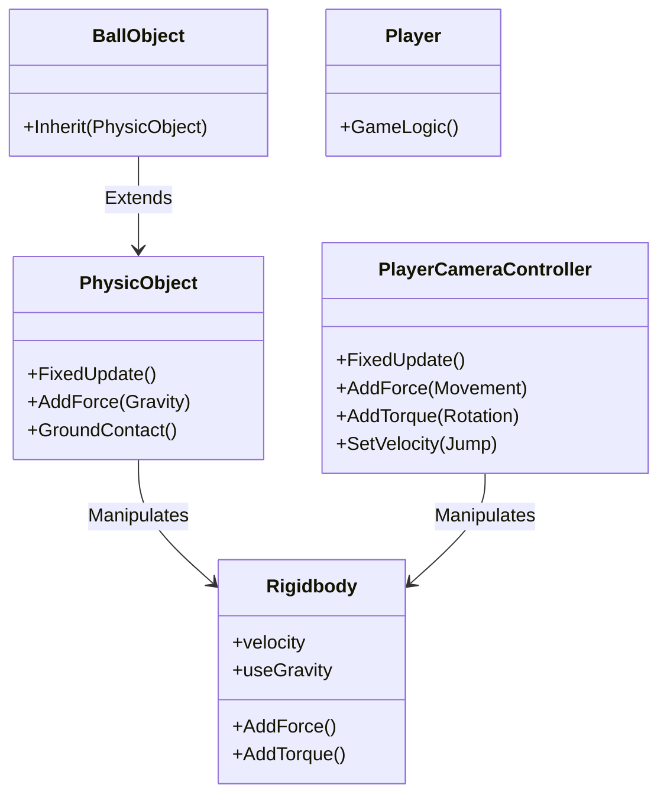
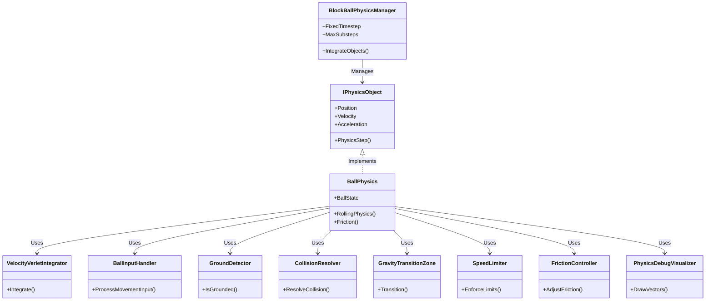

# Physics Architecture in BlockBall Evolution

## Overview
This document outlines the physics architecture of BlockBall Evolution across its migration phases (0B to 0C and beyond). It progresses from past (legacy system) to present (current modes) to future (planned enhancements), focusing on UnityPhysics (Legacy), Hybrid, and CustomPhysics modes. Optimized for clarity and token efficiency for LLM consumption.

*Last Updated: 2025-06-12 11:08h*

## 1. Past: Legacy Physics System (Phase 0B)

### 1.1 Key Characteristics
- **Force-Based Movement**: Used `Rigidbody.AddForce` for gravity and movement, unlike velocity-based updates in newer systems.
- **Unity Gravity Disabled**: Often set `Rigidbody.useGravity` to false, applying custom gravity forces.
- **Input-Driven Forces**: Player inputs translated to forces/torque, risking conflicts with new systems.
- **Update Order Risks**: `FixedUpdate` updates could overwrite new system changes due to timing.

### 1.2 Key Components
- **`PhysicObject.cs`**: Applied custom gravity via `Rigidbody.AddForce(Gravity)` in `FixedUpdate`; managed ground contact.
- **`PlayerCameraController.cs`**: Applied movement forces/torque via `Rigidbody.AddForce`/`AddTorque`; jumping modified `Rigidbody.velocity`.
- **`Player.cs`**: Handled game logic (score, keys) without direct physics interaction.
- **`BallObject.cs`**: Relied on `PhysicObject.cs` for physics logic.

### 1.3 Integration Challenges
- **Control Conflicts**: Old forces overrode new velocity updates in `PhysicsObjectWrapper.cs`.
- **Mode Interference**: Competing `Rigidbody` changes across modes without isolation.
- **Input Handling**: Needed adaptation for force (`UnityPhysics`), velocity (`CustomPhysics`), or mixed (`Hybrid`) logic.
- **Behavioral Consistency**: Required distinct tuning for consistent feel across modes.

**Note**: Many challenges addressed in Phase 0C via mode isolation and conditional logic in scripts.

### 1.4 Legacy Physics Class Diagram

## 2. Present: Current Physics Modes (Phase 0C)

### 2.1 UnityPhysics (Legacy) Mode
- **Purpose**: Preserves original Rigidbody-based physics for compatibility.
- **Key Traits**:
  - **Engine**: Unity's Rigidbody for force and velocity.
  - **Movement**: Forces via `PlayerCameraController.Move` scaled by `legacySpeedFactor`/`inputForceScale`.
  - **Braking**: Applied in `FixedUpdate` if no input, using `legacyBreakFactor`.
  - **Velocity Cap**: Skipped during braking in `PhysicsObjectWrapper.cs`; capped at `totalSpeedLimit`.
- **Friction/Drag**: Linear drag=1, angular drag=2.5; reduces rolling (adjustable via `PhysicsSettings`).
- **Components**: `PlayerCameraController.cs` (input/forces), `PhysicsObjectWrapper.cs` (velocity cap), `PhysicsSettings.cs` (params).
- **Workflow**: Input -> Force Calc (`legacySpeedFactor`) -> Apply (`AddForce`) -> Brake (`FixedUpdate`) -> Cap (conditional) -> Unity Physics Update.

### 2.2 Hybrid Mode
- **Purpose**: Combines Unity Rigidbody with custom adjustments for transition.
- **Key Traits**:
  - **Engine**: Unity's Rigidbody for forces.
  - **Movement**: Forces via `PlayerCameraController.Move` with directional magnitudes.
  - **Braking**: Minimal, only in `Move` if triggered; not in `FixedUpdate`.
  - **Velocity Cap**: Capped at `hybridSpeedLimit` in `PhysicsObjectWrapper.cs`.
- **Friction/Drag**: Same as UnityPhysics (linear=1, angular=2.5); reduced rolling.
- **Components**: `PlayerCameraController.cs` (forces), `PhysicsObjectWrapper.cs` (cap), `PhysicsSettings.cs` (params).
- **Workflow**: Input -> Force Calc -> Apply (`AddForce`) -> Cap (`hybridSpeedLimit`) -> Unity Physics Update.

### 2.3 CustomPhysics Mode - Current State
- **Purpose**: Overrides Rigidbody with bespoke logic for unique behavior.
- **Key Traits**:
  - **Engine**: Custom logic in `PhysicsObjectWrapper.cs`; bypasses Rigidbody forces.
  - **Movement**: Input processed in `PhysicsObjectWrapper.cs` using directional magnitudes; `PlayerCameraController` skips forces.
  - **Braking**: Custom logic in `PhysicsObjectWrapper.cs`, independent of legacy.
  - **Velocity Cap**: Capped at `physicsSpeedLimit`.
- **Friction/Drag**: Likely lower friction/drag or momentum-preserving logic; sustains rolling longer.
- **Components**: `PhysicsObjectWrapper.cs` (all physics), `PlayerCameraController.cs` (skips), `PhysicsSettings.cs` (params).
- **Workflow**: Input -> Custom Force Calc -> Velocity Update (custom) -> Brake (custom) -> Cap (`physicsSpeedLimit`) -> Rigidbody (optional, e.g., `IsKinematic`).

## 3. Future: Planned CustomPhysics Enhancements

### 3.1 CustomPhysics Mode - Desired State
- **Purpose**: Fully custom system with physical accuracy and enhanced gameplay.
- **Key Traits (Planned from `3_Physics_Implementation_Tasks.md`)**:
  - **Engine**: `BlockBallPhysicsManager` for 50Hz timestep; Velocity Verlet integration (`VelocityVerletIntegrator`) for energy conservation.
  - **Movement**: `BallInputHandler` projects camera input onto gravity-perpendicular plane for intuitive control.
  - **Braking**: Via `FrictionController` with adjustable static/kinetic/rolling friction.
  - **Velocity Cap**: `SpeedLimiter` with layered limits (`MaxInputSpeed`, `MaxPhysicsSpeed`, `MaxTotalSpeed`) and damping.
  - **State Mgmt**: `BallState` enum (Grounded, Airborne, Sliding, Transitioning) in `BallPhysics` for state-specific behavior.
  - **Collisions**: `GroundDetector` (precise contact checks), `CollisionResolver` (custom bounce/friction).
  - **Gravity**: `GravityTransitionZone` for smooth orientation/velocity shifts.
  - **Friction/Drag**: `FrictionController` for runtime coefficient tuning; air drag.
  - **Performance**: Zero-allocation steps via pooling; optimized collision detection.
  - **Debugging**: `PhysicsDebugVisualizer` for vectors; runtime UI stats.
- **Components**: New classes (`BlockBallPhysicsManager`, `BallPhysics`, etc.); `PhysicsSettings.cs` extended.
- **Workflow**: Register (Manager) -> Input (Camera Projected) -> State Check -> Integrate (Verlet, 50Hz) -> Collide (Custom) -> Cap (Layered) -> Visualize (Debug).
- **Key Change**: From basic custom velocity updates to structured, accurate physics with nuanced behavior and tuning.

### 3.2 Future CustomPhysics Class Diagram

## 4. Configuration and Settings

### 4.1 Current Settings (`PhysicsSettings.cs`)
- **Unity/Legacy**: `legacySpeedFactor`, `legacyBreakFactor`, `legacyJumpForce`, `totalSpeedLimit`, `linearDrag`, `angularDrag`.
- **Hybrid**: `hybridSpeedLimit`.
- **Custom (Current)**: `physicsSpeedLimit`.
- **General**: Directional magnitudes (`forwardForceMagnitude`, etc.), `inputForceScale`.
- **Note**: Detailed tooltips in script; adjustable in Unity Editor.

### 4.2 Future Settings (Planned)
- **Custom (Enhanced)**: Add friction coefficients (static, kinetic, rolling), air drag, layered speed limits (`MaxInputSpeed`, etc.), transition durations.
- **Goal**: Extend `PhysicsSettings.cs` for full runtime tuning of future `CustomPhysics` features.

## 5. Logging and Diagnostics

- **Current**: Mode-specific logs in scripts; Rigidbody properties (mass, drag); force/velocity details.
- **Future**: Enhanced via `PhysicsDebugVisualizer` (vector visualization), runtime UI for physics stats.

## 6. Conclusion

The physics architecture evolves from a legacy force-based system (Phase 0B) to a hybrid transitional state (Phase 0C) and toward a fully custom, precise system (future). This past-to-future structure tracks migration progress, with `UnityPhysics` preserving original behavior, `Hybrid` bridging systems, and `CustomPhysics` advancing from basic overrides to a sophisticated, tunable model with Velocity Verlet integration and state-driven behavior.
