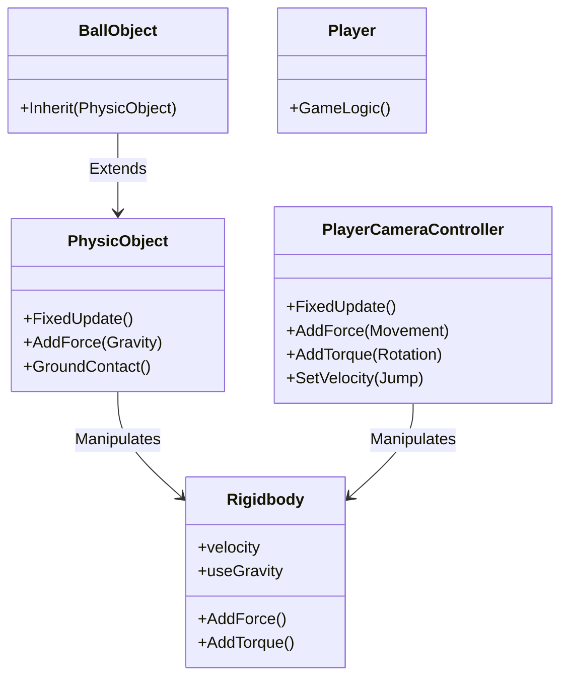
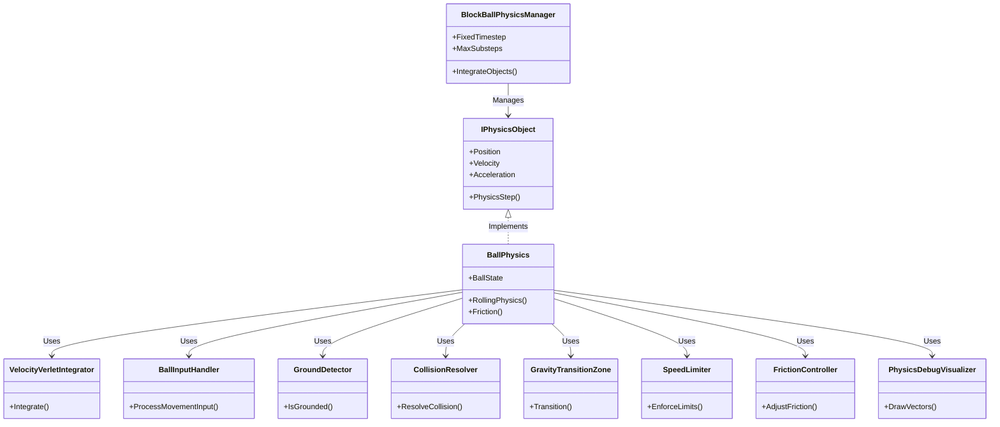

# Physics Architecture in BlockBall Evolution

## Overview
This document outlines the physics architecture of BlockBall Evolution across its migration phases (0B to 0C and beyond). It progresses from past (legacy system) to present (current modes) to future (planned enhancements), focusing on UnityPhysics (Legacy), Hybrid, and CustomPhysics modes. Optimized for clarity and token efficiency for LLM consumption.

*Last Updated: 2025-06-12 16:45h*

## 1. Past: Legacy Physics System (Phase 0B)

### 1.1 Key Characteristics
- **Force-Based Movement**: Used `Rigidbody.AddForce` for gravity and movement, unlike velocity-based updates in newer systems.
- **Unity Gravity Disabled**: Often set `Rigidbody.useGravity` to false, applying custom gravity forces.
- **Input-Driven Forces**: Player inputs translated to forces/torque, risking conflicts with new systems.
- **Update Order Risks**: `FixedUpdate` updates could overwrite new system changes due to timing.

### 1.2 Key Components
- **`PhysicObject.cs`**: Applied custom gravity via `Rigidbody.AddForce(Gravity)` in `FixedUpdate`; managed ground contact.
- **`PlayerCameraController.cs`**: Applied movement forces/torque via `Rigidbody.AddForce`/`AddTorque`; jumping modified `Rigidbody.velocity`.
- **`Player.cs`**: Handled game logic (score, keys) without direct physics interaction.
- **`BallObject.cs`**: Relied on `PhysicObject.cs` for physics logic.

### 1.3 Integration Challenges
- **Control Conflicts**: Old forces overrode new velocity updates in `PhysicsObjectWrapper.cs`.
- **Mode Interference**: Competing `Rigidbody` changes across modes without isolation.
- **Input Handling**: Needed adaptation for force (`UnityPhysics`), velocity (`CustomPhysics`), or mixed (`Hybrid`) logic.
- **Behavioral Consistency**: Required distinct tuning for consistent feel across modes.

**Note**: Many challenges addressed in Phase 0C via mode isolation and conditional logic in scripts.

### 1.4 Legacy Physics Class Diagram

## 2. Present: Current Physics Modes (Phase 0C)

### 2.1 UnityPhysics (Legacy) Mode
- **Purpose**: Preserves original Rigidbody-based physics for compatibility.
- **Key Traits**:
  - **Engine**: Unity's Rigidbody for force and velocity.
  - **Movement**: Forces via `PlayerCameraController.Move` scaled by `legacySpeedFactor`/`inputForceScale`.
  - **Braking**: Applied in `FixedUpdate` if no input, using `legacyBreakFactor`.
  - **Velocity Cap**: Skipped during braking in `PhysicsObjectWrapper.cs`; capped at `totalSpeedLimit`.
- **Friction/Drag**: Linear drag=1, angular drag=2.5; reduces rolling (adjustable via `PhysicsSettings`).
- **Components**: `PlayerCameraController.cs` (input/forces), `PhysicsObjectWrapper.cs` (velocity cap), `PhysicsSettings.cs` (params).
- **Workflow**: Input -> Force Calc (`legacySpeedFactor`) -> Apply (`AddForce`) -> Brake (`FixedUpdate`) -> Cap (conditional) -> Unity Physics Update.

### 2.2 Hybrid Mode
- **Purpose**: Combines Unity Rigidbody with custom adjustments for transition.
- **Key Traits**:
  - **Engine**: Unity's Rigidbody for forces.
  - **Movement**: Forces via `PlayerCameraController.Move` with directional magnitudes.
  - **Braking**: Minimal, only in `Move` if triggered; not in `FixedUpdate`.
  - **Velocity Cap**: Capped at `hybridSpeedLimit` in `PhysicsObjectWrapper.cs`.
- **Friction/Drag**: Same as UnityPhysics (linear=1, angular=2.5); reduced rolling.
- **Components**: `PlayerCameraController.cs` (forces), `PhysicsObjectWrapper.cs` (cap), `PhysicsSettings.cs` (params).
- **Workflow**: Input -> Force Calc -> Apply (`AddForce`) -> Cap (`hybridSpeedLimit`) -> Unity Physics Update.

### 2.3 CustomPhysics Mode - ✅ **Operational**
- **Purpose**: Full custom physics implementation with advanced features and modular architecture.
- **Current Status**: **Complete and Operational** - Fully implemented modular physics system ready for gameplay testing
- **Key Features**:
  - **Modular Architecture**: BallPhysics uses 6 specialized components for maintainability
  - **Fixed Timestep**: 50Hz physics simulation with accumulator pattern  
  - **Advanced Integration**: Velocity Verlet integration for energy conservation
  - **State Management**: Comprehensive state machine (Grounded/Airborne/Sliding/Transitioning)
  - **Input Processing**: Camera-relative input with jump buffering and coyote time
  - **Ground Detection**: Sophisticated contact detection with slope analysis
  - **Force Calculation**: Advanced force and acceleration calculations
  - **Collision Handling**: Custom collision responses and physics material support
  - **Debug Support**: Comprehensive logging and visualization tools
  - **Editor Integration**: All parameters configurable through AdvancedPhysicsSetup

## 3. Future: Additional CustomPhysics Enhancements

### 3.1 CustomPhysics Mode - Future Enhancements (Building on Completed Core)
- **Purpose**: Extend the completed Core Physics Architecture with additional advanced features.
- **Current Status**: **Core Complete** - Foundation implemented 2025-06-12, ready for enhancement
- **Additional Features to Implement (from `3_Physics_Implementation_Tasks.md`)**:
  - **Enhanced Input**: `BallInputHandler` with more sophisticated camera projection and input smoothing
  - **Advanced Friction**: `FrictionController` with runtime-adjustable static/kinetic/rolling coefficients
  - **Layered Speed Limits**: Enhanced `SpeedLimiter` with separate `MaxInputSpeed`, `MaxPhysicsSpeed`, `MaxTotalSpeed` layers
  - **Collision System**: `CollisionResolver` for custom bounce/friction responses beyond basic collision handling
  - **Gravity Transitions**: `GravityTransitionZone` for smooth orientation/velocity shifts in gravity-changing areas
  - **Performance Optimizations**: Further collision detection optimizations and memory pooling
  - **Advanced Debugging**: `PhysicsDebugVisualizer` with runtime UI stats and enhanced vector visualization

### 3.2 Future CustomPhysics Class Diagram

## 4. Configuration and Settings

### 4.1 Current Settings (`PhysicsSettings.cs`) - ✅ **All Modes Operational**
- **Unity/Legacy**: `legacySpeedFactor`, `legacyBreakFactor`, `legacyJumpForce`, `totalSpeedLimit`, `linearDrag`, `angularDrag`.
- **Hybrid**: `hybridSpeedLimit`.
- **CustomPhysics (Operational)**: 
  - **Core Parameters**: `customPhysicsTimestep` (50Hz), `maxPhysicsSubsteps`, `useObjectPooling`
  - **Speed Limits**: `maxInputSpeed`, `maxPhysicsSpeed`, `maxTotalSpeed`
  - **Jump Mechanics**: `jumpHeight`, `jumpBufferTime`, `coyoteTime`
  - **Friction/Physics**: `rollingFriction`, `slidingFriction`, `airDrag`, `slopeLimit`
  - **Detection**: `groundCheckDistance`
  - **Debug/Configuration**: `enableMigrationLogging`, `enableEnergyConservation`
- **General**: Directional magnitudes (`forwardForceMagnitude`, etc.), `inputForceScale`.
- **Editor Integration**: All CustomPhysics parameters accessible via AdvancedPhysicsSetup with runtime configuration support.

### 4.2 Future Settings (Planned)
- **Custom (Enhanced)**: Add friction coefficients (static, kinetic, rolling), air drag, layered speed limits (`MaxInputSpeed`, etc.), transition durations.
- **Goal**: Extend `PhysicsSettings.cs` for full runtime tuning of future `CustomPhysics` features.

## 5. Logging and Diagnostics

- **Current**: Mode-specific logs in scripts; Rigidbody properties (mass, drag); force/velocity details.
- **Future**: Enhanced via `PhysicsDebugVisualizer` (vector visualization), runtime UI for physics stats.

## 6. Conclusion

The physics architecture has successfully evolved from a legacy force-based system (Phase 0B) through a hybrid transitional state to a **fully operational Core Physics Architecture (Phase 0C)**. All three physics modes are now functional and available in parallel:

- **UnityPhysics**: Original force-based behavior preserved for compatibility
- **Hybrid**: Effective bridge between legacy and custom systems  
- **CustomPhysics**: **Fully operational** modular physics system featuring:
  - 50Hz fixed timestep physics manager with energy-conserving integration
  - Advanced ball physics with comprehensive state management
  - Modular architecture with 6 specialized components for maintainability
  - Full editor integration and runtime configuration
  - Comprehensive debug visualization and migration tools

**Current Status**: All physics modes are **operational and ready for gameplay**. The CustomPhysics system provides a solid foundation for future enhancements and advanced physics features.

**Migration Path**: Users can seamlessly switch between all three physics modes, with automatic conflict prevention and full backward compatibility maintained across the entire system.
